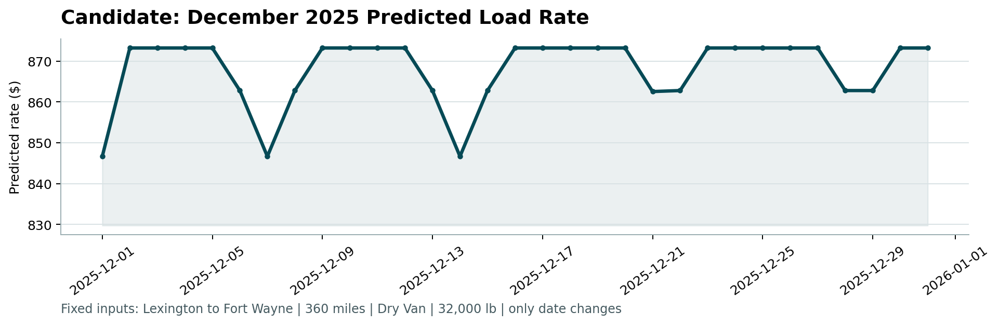

# Freight Rate Prediction

**Machine Learning Engineer Assessment**

[](https://colab.research.google.com/github/Dania-Yasir/freight-rate-prediction/blob/main/notebooks/freight_rate_model_after_edit.ipynb)

This repository contains an end-to-end machine-learning workflow for predicting freight posted rates. The solution covers exploratory analysis, time-aware validation, feature engineering, model comparison, final training, prediction of the 12,000 assessment loads, and generation of the fixed December prediction chart required by the provided scorer.

## Deliverables

The repository produces the following assessment outputs:

- `validation_predictions.csv` — predictions for all **12,000** validation loads, with exactly:

  ```text
  load_id,predicted_rate
  ```

- `data/december_chart_inputs.csv` — the **31** fixed December rows with model predictions.
- `scorer_results/candidate_december.png` — the December prediction chart produced by `score.py`.
- `notebooks/freight_rate_model_after_edit.ipynb` — the full modeling workflow.

## Repository Structure

```text
freight-rate-prediction/
├── data/
│   ├── Process/
│   │   ├── train_test_clean.csv
│   │   ├── validation_clean.csv
│   │   └── december-chart-inputs.csv
│   └── december_chart_inputs.csv
├── notebooks/
│   └── freight_rate_model_after_edit.ipynb
├── scorer_results/
│   └── candidate_december.png
├── score.py
├── validation_predictions.csv
└── README.md
```

## Data

The assessment provides labeled development data and an unlabeled validation set. The modeling notebook uses cleaned copies stored under `data/Process/`.

The cleaned training data contains **48,000 labeled loads**, while the final validation data contains **12,000 unlabeled loads**.

The main inputs include:

- pickup and delivery cities
- pickup and delivery coordinates
- distance
- equipment type
- weight
- date
- market index
- quote signal
- data-quality flags

The prediction target is:

- `posted_rate`

The final validation output uses:

- `load_id`
- `predicted_rate`

## Exploratory Data Analysis

The notebook includes visual checks for several important freight-rate relationships:

1. **Average posted rate by equipment type**
2. **Distance vs. posted rate**
3. **Average posted rate over time**

The analysis shows that freight pricing is influenced by a combination of shipment characteristics, market conditions, geography, and time rather than by a single variable.

Residual analysis also showed that a small number of extreme observations dominate squared error. In the local holdout set, the **largest 1% of absolute errors contributed about 89.9% of total squared error**, which is why both MAE and RMSE were monitored during model comparison.

## Data Quality Handling

The model consumes cleaned datasets and retains explicit quality indicators so that the model can distinguish repaired or unusual observations from ordinary records.

The retained flags are:

- `weight_missing_flag`
- `weight_negative_flag`
- `market_index_missing_flag`

Unknown categorical values at inference time are also handled safely through the encoder rather than causing prediction failures.

## Validation Strategy

A **time-based holdout** is used instead of a random split because freight rates change over time and the real assessment requires predictions on future loads.

The most recent labeled month is held out for local validation:

| Split | Date range | Rows |
|---|---|---:|
| Training | 2025-01-01 to 2025-09-30 | 43,147 |
| Local validation | 2025-10-01 to 2025-10-31 | 4,853 |

This setup better approximates the final forecasting task and reduces the risk of overly optimistic validation caused by randomly mixing earlier and later loads.

## Feature Engineering

The same feature-engineering logic is applied to training, local validation, final validation, and December chart data.

Derived features include:

- `month`
- `day_of_week`
- `days_since_start`
- `lat_diff`
- `lon_diff`
- `distance_market = distance × market_index`
- `distance_quote = distance × quote_signal`

The final HistGradientBoosting pipeline uses these derived variables together with the original numeric inputs and the following categorical fields:

- `pickup`
- `delivery`
- `equipment`

Categorical values are encoded with `OrdinalEncoder`, using `-1` for previously unseen categories. Numeric values are passed through without scaling for the tree-based model.

## Model Comparison

Several models were evaluated on the October holdout set.

| Model | MAE | RMSE |
|---|---:|---:|
| Dummy baseline | $1,179.80 | $1,528.57 |
| Random Forest | $410.30 | $800.58 |
| Ridge Regression | $171.01 | $674.67 |
| HistGradientBoosting — squared error | $163.54 | $663.59 |
| HistGradientBoosting — absolute error | **$131.88** | **$648.87** |

The experiments confirmed that nonlinear gradient boosting substantially improves on the baseline while remaining efficient on this dataset.

## Final Model

The final submission predictions are generated with a `HistGradientBoostingRegressor` trained on all **48,000 labeled rows** using squared-error loss.

Key parameters:

```python
HistGradientBoostingRegressor(
    loss="squared_error",
    learning_rate=0.05,
    max_iter=300,
    max_leaf_nodes=31,
    min_samples_leaf=20,
    l2_regularization=1.0,
    random_state=42
)
```

The squared-error variant was retained for the final submission because it remains competitive on the time-based holdout while being more responsive to larger rate movements and changing daily market conditions.

## Final Validation Predictions

After the final model is fitted on the full labeled development dataset, predictions are generated for every row in the 12,000-load validation set.

The notebook performs output checks before saving the file:

- **12,000 predictions** generated
- correct columns: `load_id`, `predicted_rate`
- **0 missing predictions**
- **0 duplicate load IDs**
- **0 non-positive predictions**
- load IDs remain in the same order as the supplied validation data

Observed prediction range in the submitted run:

- Minimum: **$329.21**
- Maximum: **$7,930.07**
- Mean: **$2,426.14**

The output is saved as:

```text
validation_predictions.csv
```

## Fixed December Prediction Chart

The assessment also requires predictions for the fixed Lexington → Fort Wayne December scenario.

For the 31 fixed daily rows, route, distance, equipment, and weight remain fixed while **daily market conditions vary through `market_index` and `quote_signal`**. Daily values are derived from the available December validation data and passed through the exact same feature-engineering, preprocessing, and final-model pipeline used for the main predictions.

This allows the model to respond to day-to-day market conditions instead of producing an artificially constant series.

December prediction summary from the submitted run:

- Rows: **31**
- Minimum: **$867.70**
- Maximum: **$888.84**
- Mean: **$884.89**

The completed December input file is saved as:

```text
data/december_chart_inputs.csv
```

The chart generated by the official scorer is:



## Scorer Validation

The provided scorer is run with:

```bash
python score.py \
  --predictions validation_predictions.csv \
  --december-predictions data/december_chart_inputs.csv \
  --output-dir scorer_results
```

Successful output from the final run:

```text
Validated 12,000 final predictions.
Validated 31 fixed December predictions.
Created chart: scorer_results/candidate_december.png
Final validation metrics are calculated by Spotter after submission.
```

## Setup

### 1. Clone the repository

```bash
git clone https://github.com/Dania-Yasir/freight-rate-prediction.git
cd freight-rate-prediction
```

### 2. Create a virtual environment

```bash
python -m venv .venv
```

Activate it:

**Windows**

```bash
.venv\Scripts\activate
```

**macOS / Linux**

```bash
source .venv/bin/activate
```

### 3. Install dependencies

```bash
pip install numpy pandas matplotlib scipy scikit-learn jupyter
```

### 4. Run the notebook

```bash
jupyter notebook notebooks/freight_rate_model_after_edit.ipynb
```

Alternatively, open the notebook directly in Google Colab using the badge at the top of this README.

## Reproducing the Submission

Run the notebook workflow in this order:

1. Load the cleaned training and validation datasets.
2. Run exploratory analysis.
3. Create the October time-based holdout.
4. Apply feature engineering.
5. Train and evaluate the comparison models.
6. Refit the final HistGradientBoosting model on all labeled rows.
7. Generate `validation_predictions.csv`.
8. Generate `data/december_chart_inputs.csv`.
9. Run `score.py`.
10. Confirm `scorer_results/candidate_december.png` was created successfully.

## Notes

- The local metrics reported above are based only on the internal October holdout.
- The final 12,000-row validation labels are not available to the candidate.
- Official final validation metrics are calculated by Spotter after submission.
- `random_state=42` is used where supported to improve reproducibility.

---

**Final submission model:** HistGradientBoostingRegressor  
**Validation strategy:** time-based holdout  
**Final prediction rows:** 12,000  
**Fixed December rows:** 31
